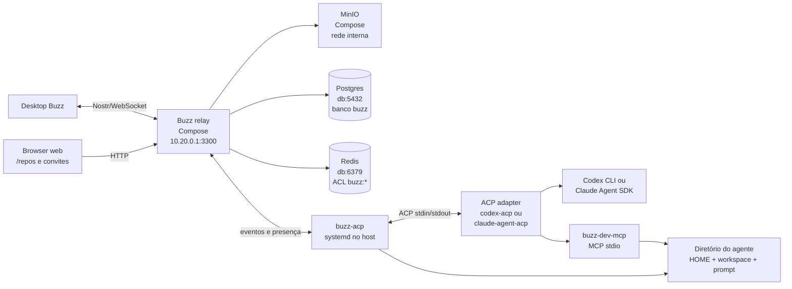

# Arquitetura do Buzz no VPS

Este documento descreve a instalação em
`/home/ubuntu/iaquant/LAB/buzz`. Relay e storage local rodam em Compose;
Postgres e Redis são centralizados no host `db`; Codex e Claude Code rodam no
host sob systemd e entram no Buzz por meio do `buzz-acp`.

## Visão geral



O relay não executa modelos. Ele autentica, armazena e distribui eventos. O
`buzz-acp` mantém uma identidade de agente conectada ao relay e delega cada
turno ao adapter ACP configurado.

## Compose base

O arquivo [compose.yaml](./compose.yaml) contém os componentes locais do Buzz:

- `relay`: relay Nostr, APIs, busca, mídia, Git e bundle web;
- `minio`: armazenamento S3 dedicado ao Buzz;
- `minio-init`: criação idempotente do bucket privado `buzz-media`.

Postgres e Redis não aparecem como serviços nesse Compose. O relay conecta-se a
eles pela WireGuard em `10.20.0.3`:

```text
DATABASE_URL -> postgres://buzz@10.20.0.3:5432/buzz
REDIS_URL    -> redis://buzz@10.20.0.3:6379/0
```

O usuário Redis `buzz` tem ACL limitada a chaves e canais `buzz:*`. O banco e o
papel Postgres `buzz` são dedicados ao Buzz; as bases existentes não são
alteradas.

MinIO usa bind mount no host:

```text
deploy/vps/data/minio -> /data
```

A porta S3 do MinIO não é publicada. O relay alcança `minio:9000` somente pela
rede Docker interna. O Garage existente permanece para os serviços que já o
utilizam.

## Relay, web e portas

O relay escuta internamente em `0.0.0.0:3000`. O Compose publica esse listener
somente em:

```text
10.20.0.1:3300 -> relay:3000
```

`3300` pertence à família `33xx` reservada ao Buzz nesta máquina e não consta
no registry atual da Pleroma. O frontend web oficial fica em:

```text
http://10.20.0.1:3300
```

Nesta versão, o bundle web cobre convites e navegador de repositórios
(`/repos`). A experiência completa de canais, mensagens e agentes continua no
Desktop, que usa `ws://10.20.0.1:3300`.

O host identifica a comunidade pelo valor de `Host`. Quando a porta mudou de
`3000` para `3300`, a comunidade existente foi atualizada no Postgres para
preservar canal e eventos.

## Agentes host-side

Um agente é uma árvore de processos, não uma porta HTTP:

```text
buzz-agent@codex-vps.service
└── buzz-acp
    ├── codex-acp
    │   └── @openai/codex app-server
    └── buzz-dev-mcp (por sessão ACP)
```

Para Claude, o adapter muda para `claude-agent-acp`, que usa o Claude Agent
SDK.

O `systemd` supervisiona `buzz-acp`: inicia no boot, reinicia falhas, agrupa os
filhos para encerramento e envia stdout/stderr ao journal. O harness conecta-se
ao relay por WebSocket e usa ACP por stdin/stdout com o adapter. O relay não
sabe se o launcher veio do systemd, de um container ou de um terminal.

O template está em [buzz-agent@.service](./buzz-agent@.service):

```bash
sudo systemctl enable --now buzz-agent@codex-vps
sudo systemctl status buzz-agent@codex-vps
sudo journalctl -u buzz-agent@codex-vps -f
```

`Restart=on-failure` reinicia crashs. `!shutdown` encerra o harness normalmente;
uma parada explícita com `systemctl stop` permanece parada.

O agente de produção **Juri Root** usa o unit separado
[buzz-agent-juri-root.service](./buzz-agent-juri-root.service). Ele não usa o
template legado: roda como o usuário Linux `buzz-juri-root`, com runtime
somente-leitura em `/opt/buzz-agent-runtime` e estado em
`/srv/buzz-agents/juri-root`. Assim, uma ferramenta usada pelo Root não pode
ler a identidade da dona em `/home/ubuntu/.config/pleroma/buzz.env`.

## Prompt e contexto

O arquivo `instructions.md` é lido pelo `buzz-acp`, não diretamente pelo
Codex/Claude. A configuração usa:

```env
BUZZ_ACP_SYSTEM_PROMPT_FILE=/home/ubuntu/iaquant/LAB/buzz/deploy/vps/agents/<nome>/instructions.md
```

Na inicialização, o harness lê esse arquivo para memória. Para adapters ACP
modernos, como `codex-acp` e `claude-agent-acp`, envia o texto como
`systemPrompt` em `session/new`. Também pode acrescentar contexto base do Buzz,
instruções da equipe, memória do agente e canvas do canal.

Alterar `instructions.md` exige reiniciar o agente para a próxima sessão:

```bash
./agent.sh restart codex-vps
```

Para o Juri Root, a fonte versionada do prompt é
[juri-root.instructions.md](./juri-root.instructions.md). A cópia usada pelo
serviço fica em `/srv/buzz-agents/juri-root/instructions.md`; após mudá-la,
reinicie com `sudo systemctl restart buzz-agent-juri-root`.

O histórico da conversa vem do relay. O prompt estático não substitui eventos,
identidade ou memória persistida no Buzz.

## HOME isolado

Cada instância usa diretórios próprios:

```text
agents/codex-vps/home/
agents/codex-vps/workspace/
```

O unit define:

```text
HOME              = agents/<nome>/home
CODEX_HOME        = agents/<nome>/home/.codex
CLAUDE_CONFIG_DIR = agents/<nome>/home/.claude
```

Isso separa histórico, cache, sessões e configurações entre agentes. O comando
`./agent.sh auth codex-vps codex` copia somente o login do Codex para o HOME do
agente. Para Claude, use `auth ... claude`.

Essa é uma sandbox de estado e escrita, não isolamento equivalente a um
container: o serviço roda como `ubuntu` e pode ler arquivos que esse usuário
possa ler. O unit reduz escrita acidental com `ProtectSystem=strict`,
`ReadWritePaths` limitados ao `home`/`workspace`, `PrivateTmp`,
`NoNewPrivileges`, capabilities removidas e encerramento do grupo de processos.

Para isolamento de credencial mais forte, use API keys distintas ou usuários
Linux distintos por agente. Compartilhar a mesma sessão Codex/Claude entre
agentes mistura quota, histórico e autorização.

O Juri Root adota esse segundo modelo:

```text
User                 = buzz-juri-root
HOME / CODEX_HOME    = /srv/buzz-agents/juri-root/home
workspace            = /srv/buzz-agents/juri-root/workspace/juridico
prompt               = /srv/buzz-agents/juri-root/instructions.md
agent.env / identidade = /srv/buzz-agents/juri-root (modo 0600)
runtime ACP          = /opt/buzz-agent-runtime (root, somente leitura)
ProtectHome          = yes
```

`ProtectHome=yes` remove `/home` do namespace de mount do serviço. O usuário
dedicado tampouco tem permissão Unix para atravessar `/home/ubuntu`. A sessão
Codex foi copiada apenas para o `CODEX_HOME` do Root; ele não recebe token de
GitHub e o clone mantém `origin` como repositório remoto de leitura/escrita
somente quando uma credencial própria for provisionada.

## Identidade e autorização

O dono e cada agente têm chaves Nostr diferentes:

```text
dono   -> ~/.config/pleroma/buzz.env
agente -> agents/<nome>/agent.env
Juri Root -> /srv/buzz-agents/juri-root/agent.env
```

Um agente precisa de:

1. identidade própria gerada por `buzz-admin generate-key`;
2. membership no relay (`./agent.sh add-member <pubkey>`);
3. membership no canal, normalmente com papel `bot`;
4. perfil publicado usando a chave do agente.

`BUZZ_ACP_AGENT_OWNER` aponta para a chave pública do dono. Com
`BUZZ_ACP_RESPOND_TO=owner-only`, o harness encaminha menções do dono e mantém
`!cancel`, `!rotate` e `!shutdown` como controles do dono. O agente assina
cada resposta com sua própria chave.

## Fluxo de criação

```bash
cd /home/ubuntu/iaquant/LAB/buzz/deploy/vps
./agent.sh create novo-agente
./agent.sh keygen novo-agente
./agent.sh auth novo-agente codex       # ou: claude
```

Depois:

1. Copie `Secret key` de `agents/novo-agente/identity.txt` para
   `BUZZ_PRIVATE_KEY` em `agent.env`.
2. Escolha `codex-acp` ou `claude-agent-acp` em `BUZZ_ACP_AGENT_COMMAND`.
3. Ajuste `instructions.md` e `workspace/`.
4. Registre a chave pública com `./agent.sh add-member <pubkey>`.
5. Adicione a chave ao canal com papel `bot` usando a identidade do dono.
6. Publique o perfil do agente com `buzz users set-profile`.
7. Inicie com `./agent.sh start novo-agente`.

O Desktop deve atualizar presença e permitir a menção do perfil.

## Operação

Relay e MinIO:

```bash
cd /home/ubuntu/iaquant/LAB/buzz/deploy/vps
docker compose --env-file .env -f compose.yaml ps
docker compose --env-file .env -f compose.yaml logs -f relay
sudo systemctl status buzz-vps
```

Agente:

```bash
./agent.sh status codex-vps
./agent.sh logs codex-vps
./agent.sh restart codex-vps

# Root jurídico isolado
sudo systemctl status buzz-agent-juri-root
sudo journalctl -u buzz-agent-juri-root -f
sudo systemctl restart buzz-agent-juri-root
```

O healthcheck do relay é interno (`/_readiness` em `:8080`). Apenas
`10.20.0.1:3300` é necessário para Desktop/browser na VPN.

## Observabilidade

A observabilidade é um overlay opcional, sem fork do Buzz:

```text
relay :9102 ── Prometheus ───────────────────────────┐
relay OTLP ─── Tempo ────────────────────────────────┼── Grafana :3311/VPN
systemd agents ───────────────┐                      │
Docker logs ── bridge host ───┴─ journald ─ Alloy ─ Loki
```

O relay já implementa `/metrics` e OTLP. O projeto em
`observability/compose.yaml` somente conecta essas interfaces a componentes
locais. Ele usa um projeto Compose separado e entra na rede externa
`buzz-vps_buzz-net`; assim seu `down` não remove relay ou MinIO. Prometheus
(`3310`) e Grafana (`3311`) escutam em `BUZZ_BIND_HOST`; Loki, Tempo e Alloy
permanecem na rede privada.

Alloy não recebe `/var/run/docker.sock`. Um socket Docker montado read-only
continua aceitando operações mutáveis da API e seria uma credencial equivalente
a root. Em vez disso, Alloy lê `/var/log/journal` como somente leitura e mantém
apenas os units Buzz. Relay e MinIO permanecem no `json-file` rotacionado; o unit
host-side opcional `buzz-container-logs.service` executa `docker compose logs`
somente para esses serviços e espelha a saída no journal.

Retenção inicial:

| Sinal | Retenção/limite |
|---|---|
| métricas Prometheus | 15 dias e 5 GB |
| logs Loki | 14 dias |
| traces Tempo | 72 horas |
| logs Docker | 5 arquivos de 50 MB por container |
| journald do host | política global do host; hoje 7 dias/256 MB |

As retenções são operacionais e não substituem o audit log de domínio, os
eventos Nostr persistentes ou backups. NIP-AO continua efêmero no relay e o
archive de Activity continua local ao Desktop.

## Dados e backup

Postgres contém eventos Nostr, mensagens, canais, perfis, membership e
workflows. Redis contém presença, pub/sub e cache. MinIO contém mídia e objetos
Git. O diretório `deploy/vps/data/git` contém o cache local do relay; o storage
autoritativo de Git é o bucket S3 do Buzz.

Antes de atualizar ou remover um agente, preserve:

- `deploy/vps/.env` (modo `0600`);
- banco `buzz` no Postgres de `db`;
- `deploy/vps/data/minio`;
- `deploy/vps/data/git`;
- `agents/<nome>/home` e `agents/<nome>/workspace`.
- `/srv/buzz-agents/juri-root/home`, `workspace`, `agent.env` e
  `identity.txt`.

Se o overlay de observabilidade estiver ativo, preserve também os volumes
Compose `prometheus-data`, `grafana-data`, `loki-data`, `tempo-data` e
`alloy-data` quando o histórico operacional for necessário. Não coloque dumps,
tokens OTLP ou a senha do Grafana no Git.

Não use `docker compose down -v`. O material de rollback da migração inicial
fica fora do Git em `.local/migration/`.

## Estado validado

Em 17 de setembro de 2026:

- relay e MinIO estão saudáveis;
- Postgres e Redis remotos conectaram no boot;
- `BUZZ_GIT_CONFORMANCE_PROBE=true` passou contra MinIO;
- frontend web respondeu em `http://10.20.0.1:3300`;
- WebSocket/NIP-42 foi validado em `ws://10.20.0.1:3300`;
- `buzz-vps.service` está habilitado e ativo;
- adapters `codex-acp` `1.12.0` e `claude-agent-acp` `0.79.0` estão no host;
- `codex-vps` está ativo via systemd;
- Codex app-server iniciou usando o HOME isolado;
- uma menção real ao agente produziu resposta assinada no canal `geral`.
- o Juri Root está ativo em `buzz-agent-juri-root.service`, com clone limpo do
  commit jurídico `2155332`;
- uma menção real ao `@Juri Root` produziu `Juri Root online.` no canal
  `geral`;
- o namespace do serviço do Root não enxerga a identidade da dona em
  `~/.config/pleroma/buzz.env`.

O container genérico de agente foi removido do caminho principal porque não
teria acesso automático aos runtimes e sessões Codex/Claude instalados no host.
